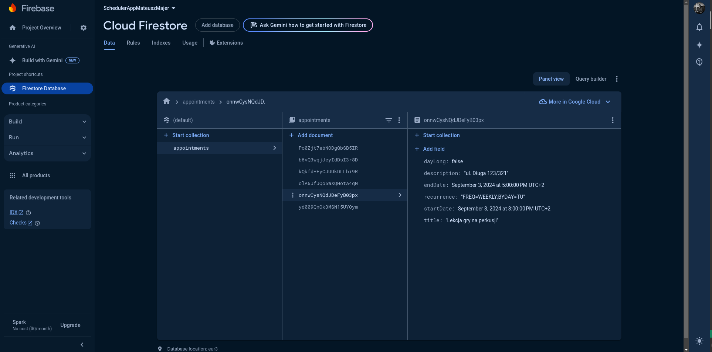
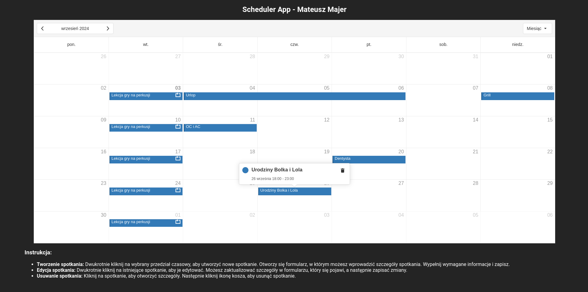

# Scheduler App - Mateusz Majer

[](https://app.netlify.com/sites/scheduler-majer/deploys)

> **Live Project:** [Scheduler App on Netlify](https://scheduler-majer.netlify.app/)

## Description

The **Scheduler App** is a web application designed to help users manage their appointments effectively. With this app, users can easily create, update, and delete appointments within a calendar-based interface. The app utilizes the Firestore API for efficient data storage and retrieval, ensuring that all scheduling data is securely stored and accessible in real-time.

## Features

- **Create Appointments:** Add new appointments to your schedule with a simple and intuitive interface.
- **Update Appointments:** Modify existing appointments to keep your schedule up-to-date.
- **Delete Appointments:** Remove appointments that are no longer needed.
- **Real-Time Synchronization:** All changes are instantly reflected across all devices, thanks to Firestore's real-time capabilities.

## Tech Stack

- **Frontend:** JavaScript, React/Vite
- **Library:** DevExtreme React Scheduler
- **Backend:** Firestore API
- **Deployment:** Netlify

## Getting Started

To run the Scheduler App locally, follow these steps:

### Prerequisites

- Node.js installed on your machine.
- Firebase account and Firestore setup.

### Installation

1. **Clone the repository:**

   ```bash
   git clone https://github.com/Vectari/Scheduler_app_Mateusz_Majer.git
   ```

2. **Navigate to the project directory:**

   ```bash
   cd Scheduler_app_Mateusz_Majer.git
   ```

3. **Install the dependencies:**

   ```bash
   npm install
   ```

### Configuration

1. **Set up Firebase:**

   - Go to the Firebase Console.
   - Create a new project and enable Firestore.
   - Obtain your Firebase configuration details (API key, project ID, etc.).

2. **Configure the app:**

   - Create a `.env` file in the root directory of your project.
   - Add your Firebase configuration details to the `.env` file.

   Example:

   ```env
   API_KEY=your_api_key
   AUTH_DOMAIN=your_auth_domain
   PROJECT_ID=your_project_id
   STORAGE_BUCKET=your_storage_bucket
   MESSAGING_SENDER_ID=your_messaging_sender_id
   APP_ID=your_app_id
   ```

### Running the Application

1. **Start the development server:**

   ```bash
   npm start
   ```

2. **Open your browser and navigate to:**

   ```
   http://localhost:5173/
   ```

## Deployment

The Scheduler App is deployed using Netlify.

> **Live Project:** [Scheduler App on Netlify](https://scheduler-majer.netlify.app/)

## Firestore screenshot:



## App screenshoot:


